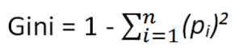

# Dokumentacja 

## Autorzy
Paulina Przybyłek
Jakub Wiśniewski
Dawid Przybyliński

start: 9 grudnia 2019

## Konspekt projektu

Cele projektu, jego krótka charakterystyka i opis podziału pracy zostały zawarte w pliku Konspekt.pdf. Projekt będzie realizowany zgodnie z zawartymi tam informacjami. Zaleca się zapoznanie z nim.

### @ToDo

Teraz punkt 7 z konspektu, wziąć jakieś większe dane niż mamy do tego, powoli wkraczamy w las

Dodatkowo:
- Można zrobić testy oddzielnie dla metody findBestSplit() w DecisionTreeTests
- Nie ma testów dla braków danych, trzeba sprawdzić jak się zachowuje algorytm, gdy na to na trafi i pewnie coś dopisać

### Done : 
**Klasa csvToDataFrame**    
  Celem tej klasy jest konwertowanie plików csv na Ramki danych naszego autorstwa. 
Do konstruktora przyjmuje ścieżkę do pliku csv oraz separator użyty w pliku. 
Ważne! Csv MUSI posiadać header, jeżeli nie będzie go miało wczytany zostanie pierwszy wiersz danych.
Sprawdzane jest także, czy w żadnej kolumnie podanego pliku csv nie ma pomieszanych wartości numerycznych z wartościami
tekstowymi. Jeżeli zajdzie taka sytuacja program wyrzuci wyjątek.
Obsługuje wyjątki gdy plik jest pusty oraz gdy nie ma rozszerzenia csv.
  
>  ***getColnames()***   
>    zmienia pierwszy wiersz na listę kolumn.
    
>  ***convertToDataFrame()***   
>    Konwertuje linia po lini csv i dodaje do obiektu DataFrame. 

**Klasa DataFrame**   
  Klasa ma za zadanie być naszym głównym narzędziem do posługiwania się danymi. Jednolita, z tymi samymi typami danych w kolumnach będzie świetną i wygodną alternatywą dla R-owych data Frame i Pythonowych Pandasów. 
  
>   ***convertToNumeric()***   
>      Dla każdej kolumny sprawdza czy jest Stringiem, jeżeli tak, to każdy odmienny string zamienia na inną liczbę. Operacje wykonuje na istniejącym DataFrame. Zwraca void. 

>   ***setToPredict(String colname)***  
>      Oznacza kolumnę jako tą, na której będziemy trenować, a później przewidywać.

>   ***getValuesToPredict()***    
>      Zwraca nam kolumnę, którą będziemy w przyszłości przewidywać. W szczególności wykorzystywane przy liczeniu indeksu Gini.

>   ***getColumn(String column)***          
>     Zwraca wartosci w danej kolumnie.

>   ***getDataFrame()***         
>     Zwraca hashmapę, gdzie klucze to nazwy kolumn, a wartościami są wartości w tych kolumnach.

>   ***setColnames(ArrayList<String> colnamesToChange)***         
>     Ustawia nowe nazwy kolumn/zmienia nazwy kolumn w DataFrame przy wykorzystaniu metody setColname(String oldName, String newName).

**Klasa Gini**  
  Indeks Gini odpowiada dystrybucji klas w zbiorze. Gdy przykładowo w danym zbiorze będzie tyle samo elementów o klasach odpowiednio A oraz B to indeks Gini wynosi 0.5. Jeżeli w tym zbiorze będą tylko elementy klasy B, to indeks wynosił będzie 0. Im mniejszy indeks, tym mniejsza entropia w danym zbiorze. Sam indeks posiada wartości od 0 -gdy jest tylko jedna klasa, do 1, gdy jest nieskończenie wiele klas o bardzo małym prawdopodobieństwie.

Indeks Gini określa się wzorem:

Do konstruktora potrzebuje ramki danych DataFrame z określoną wcześniej kolumną oraz valuesToPredict

>    ***calculateGiniIndex(ArrayList <Integer\> rowIndexes)***  
>       Dla danych indeksów rzędów (a dokładniej dla kolumny toPredict) liczy indeks Gini. Zwraca liczbę zmiennoprzecinkową od 0 do 1.

**Klasa Node**    
  Klasa odpowiada za tworzenie węzłów przy budowaniu drzewa. Węzły są decyzyjne (Node.Decision) i jako liście (Node.Leaf), stworzone jako klasy wewnętrzne klasy Node. Leaf zawiera jedynie indeksy jakie wpadają do niego oraz dominantę dla tych indeksów, a Decision: indeksy, nazwy kolumn jakie zostały do podziału, nazwę kolumny, której podziału dotyczy węzeł, prawe i lewe dziecko, wartość podziału, głębokość drzewa na danym poziomie oraz dwie listy i wartości indeksu gini dla prawego i lewego dziecka. Obie klasy wewnętrzne posiadają gettery i settery.
  
**Klasa DecisionTree**   
  Klasa odpowiada za tworzenie drzew. Korzysta ona ze wszystkich dotychczasowych napisanych funkcji. Drzewo składa się z głowy (head), węzłów decyzyjnych (Node.Decision) i liści (Node.Leaf). Rośnie rekurencyjnie. Do jego stworzenia potrzeba ramki danych DataFrame z ustawioną kolumną do przewidywania (setToPredict), wybranych indeksów i kolumn oraz maksymalnej głębokości drzewa. 

>    ***findBestSplit(ArrayList<String> colnames, ArrayList<Integer> indexes , Gini gini)***    
>     Metoda znajduje najlepszy split (punkt splitu) ze wszystkich danych kolumn i ich indeksów, zwraca listę zawierającą nazwę kolumny i wartość, która to ma najlepszy podział zmiennych - korzysta z metody split.

>   ***split(String colname,ArrayList<Integer> indexes, Gini gini)***     
>     Dla danej kolumny i indeksów znajduje najlepszy punkt podziału zmiennych - posiadający najlepszy indeks Gini. Zwraca listę zawierającą wartość splitu i index dla niego.

>   ***GrowTree(Node.Decision node)***    
>     Rekursywna metoda tworzenia drzewa.

>   ***CultureTree()***     
>     Tworzy najpierw head drzewa a potem, jeśli spełnione są odpowiednie warunki kolejne węzły drzewa, korzystając z metody GrowTree.

>   ***predict(DataFrame data)***      
>     Zwraca listę dominant - wartości przewidzianych dla każdego wiersza z podanej DataFrame.

>   ***dominant(ArrayList<Integer> vals)***      
>     Oblicza dominantę dla podanych wartości.

